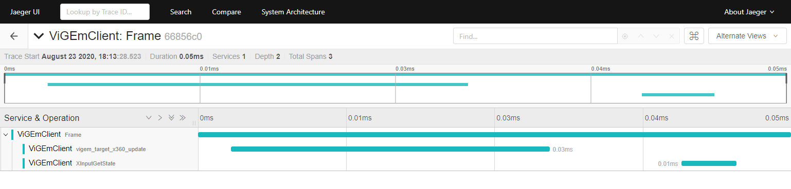
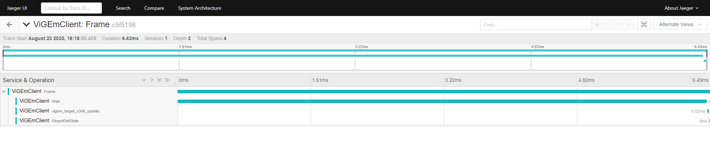

# ViGEm.Jaeger

Benchmark tool for the client SDK using [Jaeger Tracing](https://www.jaegertracing.io/)

## About

Ever questioned the performance of `ViGEm` and worried how much time its use chops off of your game loop? Well, instead of believing the authors you can simply test yourself using this tool in conjunction with [Jaeger](https://www.jaegertracing.io/) (and [OpenTracing](https://opentracing.io/)).

## Usage

1. Set up Jaeger Tracing ([the `jaeger-all-in-one(.exe)` package is recommended](https://www.jaegertracing.io/docs/latest/getting-started/#all-in-one))
2. Build/download and run this tool with the [`ViGEmBus` driver](https://github.com/ViGEm/ViGEmBus/releases) installed and **no other gamepad connected!**
3. Navigate to `http://localhost:16686/search` and observe the collected tracing information

## Example run

By default the tool simulates a 144Hz/FPS 6.9ms wait game loop, so the APIs get polled around a 144 times per second and the time spent on the actual output and input APIs is captured and visualized like this example run:

Frame without wait span:

Frame including wait ("idle") span:

As you can observe these numbers are quite pleasing 😊
